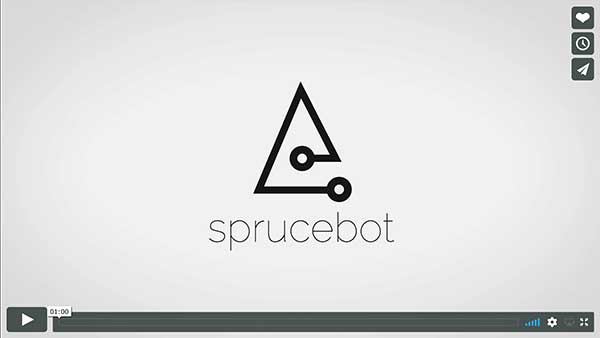

# sprucebot-cli
Hey, I'm Sprucebot! This CLI was designed to give you the tools you need
to help brick-and-mortar businesses thrive in the Internet age. Once I'm
up and running in a store, you'll be able to react to real world events, such
as guests entering or leaving.

Once your skill is ready and making an impact, you can submit it to the
Skills Marketplace so other boutiques, bars, retailers, etc. can start
taking advantage of it.

Remember, our goal is to connect people, not replace them. So make
sure your skill promotes human-to-human connection.

# Skills Development
Skills are how you give me new... well, skills. A skill is really analogous to
an app. It needs to be fully featured and create a real world experience people remember.
Keep in mind as you're out saving small business that the thing that makes
brick-and-mortar unique is the fact that real people are interacting face-to-face.

It's the ultimate social network, and with your skills giving me the power to
facilitate amazing experiences, brick-and-mortar, ma and pa shops will live long into the future. 🌲🤖

### Prerequisites
* TBD

### Installation
* ~~`yarn add -g sprucebot-cli` or `npm install -g sprucebot-cli`~~

### Commands

* `sprucebot skill create "[Skill Name]"`
  * TBD
* `sprucebot skill listen [eventName]`
  * Adds a listener to your skill.
* `sprucebot skill ignore [eventName]`
  * TBD

### Developer Guidelines
* See [CONTRIBUTING](https://github.com/sprucelabsai/sprucebot-cli/blob/dev/CONTRIBUTING.md) for the rules around skill development.

#  Platform Development
This section is only relevant if you've been given permission to work directly on my core systems.
### Prerequisites
* Access to github.com repositories is controlled via ssh. You will need to add your public key to github.com to be able to read project dependencies. More information can be found [here](https://help.github.com/articles/connecting-to-github-with-ssh/)
* [Docker For Mac](https://www.docker.com/docker-mac) Should be installed on the host machine
* [Git](https://git-scm.com)
* [bash](https://www.gnu.org/software/bash/)

### Installation
* ~~`yarn add -g sprucebot-cli` or `npm install -g sprucebot-cli`~~
* Clone the repo to your local machine `git clone git@github.com:sprucelabsai/sprucebot-cli.git`
* Install dependencies `yarn install` or `npm install`
* Create symlink in global folder `yarn link` or `npm link`
* Reload your terminal and verify installation with `sprucebot -V`

### Developer Guidelines
* See [CONTRIBUTING](https://github.com/sprucelabsai/sprucebot-cli/blob/dev/CONTRIBUTING.md) for the rules around platform development.

### Commands

* `sprucebot platform init`
  * *REQUIRED* You need to fork `com-sprucebot-api` and `com-sprucebot-hello` projects
  * Clones platform repositories and setup local docker build
  * Creates docker-compose build directory
* `sudo sprucebot platform configure`
  * Setup dns and hosts configurations.
  * Adds `local.sprucebot.com`, `local-api.sprucebot.com`, and `local-devtools.sprucebot.com` to `hosts`
* `sprucebot platform start`
  * Runs docker-compose from sprucebot build directory
  * Visit [Local Sprucebot](https://local.sprucebot.com) to verify platform is running properly
* `sudo sprucebot platform remove`
  * Allows for the removal of platform specific files and configurations
  * Asks user to `rm -rf sprucebot/*`
  * Asks user to remove `loopback` alias
  * Asks user to remove `hosts` redirects (`*.sprucebot.com`)